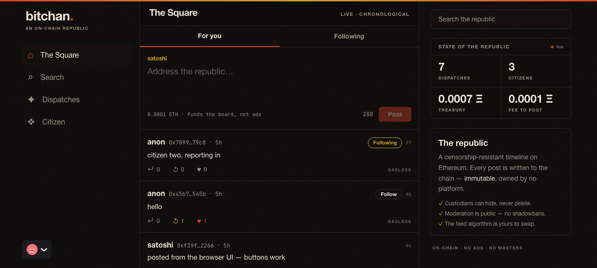

# bitchan

An on-chain social republic — a censorship-resistant, X-style timeline on
Ethereum L1. Posts live on-chain (+ Arweave for media); moderation is
**transparent and elected**, governed by a constitution ratified by a convention
of the 42 Framers.



**Docs:** [White paper](docs/WHITEPAPER.md) · [Architecture](docs/ARCHITECTURE.md) · [Constitution](docs/CONSTITUTION.md) · [Ratifying Convention](docs/CONVENTION.md) · [Governance MVP spec](docs/GOVERNANCE_MVP.md)

## Monorepo

| Package      | What                                                              |
| ------------ | ----------------------------------------------------------------- |
| `contracts/` | Solidity 0.8.30 + Foundry — the `Bitchan` contract + tests        |
| `indexer/`   | Ponder — turns contract events into a GraphQL read model          |
| `web/`       | Vite + React + Tailwind (mobile-first), wagmi / viem / RainbowKit |

## Prerequisites

- [Bun](https://bun.sh) ≥ 1.3
- [Foundry](https://book.getfoundry.sh) (`forge`, `anvil`, `cast`)
- Node (only used by the ABI-sync codegen step)

## Run the whole local env

```bash
bun install
bun run dev      # anvil + deploy + indexer + web, all wired together
```

Then, in a second terminal, post some demo content:

```bash
bun run seed     # 3 posts (1 reply), a like, a follow, handle "satoshi"
```

Open **http://localhost:5173**. To post from the UI, import an Anvil dev
account into MetaMask and add the local network:

- Network: `http://127.0.0.1:8545`, chain id `31337`
- Account #0 (also the president): `0xac0974bec39a17e36ba4a6b4d238ff944bacb478cbed5efcae784d7bf4f2ff80`

> The Anvil keys above are public test keys — never use them on a real network.

## Endpoints

- Web: http://localhost:5173
- GraphQL: http://localhost:42069/graphql
- RPC: http://127.0.0.1:8545

## Common commands

```bash
bun run contracts:test          # forge test
bun run contracts:build         # forge build
bun run sync-abi                # regenerate the TS ABI after contract changes
bun run contracts:deploy:local  # deploy to a running anvil
```
